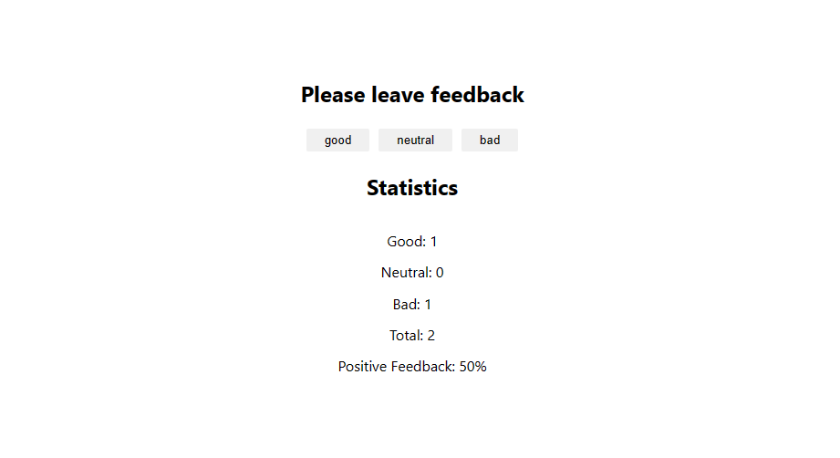

#Feedback

https://viache-slav.github.io/goit-react-hw-04-feedback/ - link to the working page in github

This project was created as a react.js homework assignment from GOIT school

The application shows the number of collected responses from the customer both for each category and in general, as well as calculates the percentage of customer satisfaction.

To run the project on your hardware: 
   -you need to clone this repository https://github.com/Viache-Slav/goit-react-hw-04-feedback.git
   -run the installation with the command `npm install`
   -start the project with the command `npm start`

## screenshot
